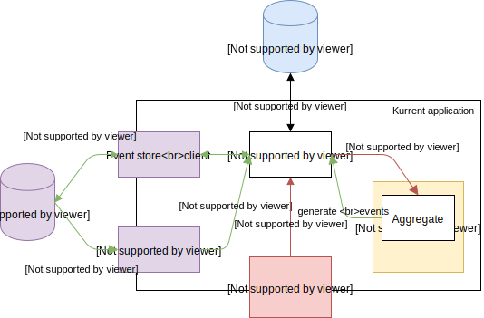

# kurrent

Thin event sourcing framework written in Kotlin.

## Usage

This is an experimental hobby project that has not been used in production and provides no guarantees of production 
readiness. It does not currently have a release version.

## Architecture

For an introduction to event sourcing, see [this Martin Fowler article](https://martinfowler.com/eaaDev/EventSourcing.html). 

### Terms

- *Event*: a change which has been applied to application state at some point in the past. 
- *Command*: a request to apply a change to the application state. A command may be rejected, or may be accepted raising
  one or more events describing the change. 
- *Aggregate*: a logical unit of the application's domain model, using terminology borrowed from domain driven design (DDD). 
  An aggregate's state is modified in response commands and those modifications are represented as events. 
- *Event store*: where application state is saved, as an immutable log of domain events.
- *Snapshot*: a view of the application domain materialized from the log of events. Provides a throwaway, reproducible, 
  read-optimized store that services queries much faster than reconstructing aggregates from the event store at read-time.
  The snapshot store is used internally and can also be exposed as a read interface to your application.    

### Overview

Green and red arrows represent the flow of events and commands respectively.

Kurrent's core (white) provides tools to write your domain model as aggregates, and application services to manage those 
aggregates (applying events and commands, reading and writing from the event and snapshot stores). 
The core is agnostic of the technology you choose to implement your event and snapshot stores, and how you expose your
domain to commands.

Your event store (purple) could be anything that can have immutable log-like semantics, e.g. a persistent Kafka topic or
an append-only relational database table. In these examples, the log reader could be a Kafka consumer or some method of
change data capture (CDC) appropriate to your database vendor, e.g. the MySQL binary log. Kurrent provides 
implementations for certain technologies in kurrent-store-* modules. Note that active CDC is optional, as discussed in
the [data flow](#data-flow) section 

Your snapshot store (blue) implementation could be anything you like (including having no snapshots at all) - in memory, 
your favourite data store, etc. The snapshot store does not have to be updated for every change to the aggregate, and
may not write anything at all. The less frequently you write to the snapshot store, the more frequently the application
will have to rebuild the entire aggregate from the event store, which is a lot more work at read-time. You may also use
an entirely different snapshot store implementation for different aggregates. Remember that snapshots are effectively
disposable because you can always rebuild the entire application state from the event log.

Your application will provide a command handler (red) which accepts commands from your application's clients to apply
changes to the application state.

### Data flow

- A command is sent to the application by a client. It is routed to the aggregate service corresponding to the relevant
  domain entity. This initializes a new aggregate if the command creates a new entity, or is applied to an existing
  aggregate. The existing aggregate is loaded from the snapshot store (if available) or rebuilt from the event log
  before receiving and validating the command.
- If the command is accepted, one or more events are raised describing the change. These events are written to the
  event store.
- If you are using a change data capture (CDC) module, at some point in the future, the event log reader receives the 
  event(s) from the log. These are routed back to the appropriate aggregates via aggregate services. This causes the 
  aggregate's actual internal state to change (unlike when handling commands, which simply raise events describing the 
  change), so that a view of the current state can be (optionally) written to the snapshot store.
  Note that these modules are optional - if you choose not to use one, your aggregates and snapshots will be updated 
  passively at read time.
- Your applications read clients will read from the snapshot store, with an optional fallback to the event store if no
  snapshot is available. Note that the state of the snapshot store is eventually consistent with the event store (at 
  best; your snapshot store implementation may skip some or all snapshots entirely)
  
### Concurrency 

#### Event ordering

The chosen event store must have immutable log-like semantics. Using a single event log implies a defined total order of 
events. This also implies no more than a single thread may consume the event log at once to ensure aggregates are
consistently reconstructed from the log. In practice, this will become an application bottleneck extremely quickly.

The conventional approach to this problem is to partition the event log into many logs that have total ordering 
themselves but no defined order between events in different partitions. It's important to realize that this will cause 
timing problems, especially when rebuilding the application state from the log, if there are causal dependencies
between events in different partitions.

The correct way to partition the event log will depend on the requirements of your application. Example partitioning
schemes include by aggregate type, by a consistent hash of the aggregate ID, by tenant in a multi-tenant application, or
any appropriate combination of these.

#### Aggregate versioning

Snapshots, events and commands all have an aggregate version assigned to them. Since the snapshot store - and therefore
data reads - are eventually consistent, multiple clients may not see each other's changes when modifying the same
aggregate. 

Kurrent uses optimistic concurrency control to prevent the 'losing' client from making its changes. The
version of an aggregate increases with every event that is applied. Clients specify the version number they have most
recently observed when sending commands, and those commands will fail if the version number has since changed. What
happens next depends on the client's implementation of the application's requirements; for example it could just give
up, or obtain the latest version, potentially displaying it to to the user, before retrying.
